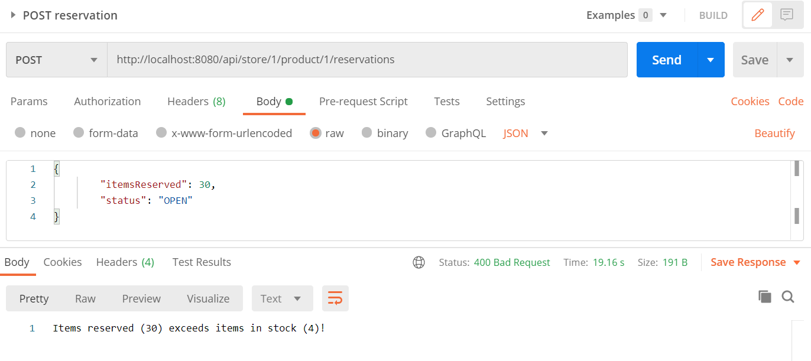

# Spring Demo

This is a test project to demo a REST API for a product and stock management system using Gradle, Spring Boot, Spring
Web, Spring Data and an H2 database. The initial project was generated using Spring Initializr. The database contains an
initial testset of data for stores, products, stocks and reservations that is automatically loaded (see data.sql in the
resource folder).

Since this project uses Gradle-wrapper and an in-memory H2 database, it can be run without a local Gradle installation
or an installed database. The only local requirement is Java 11. Run the following command:

> ./gradlew bootRun

To access the HTTP GET endpoints (or the H2 embedded GUI console) open the context root in your browser:

> http://localhost:8080/api

# Data model

This test project models a domain with multiple physical stores, where each store can hold many products in stock. A
store's stock of products can be read, created, updated and deleted. Part of the stock can be reserved to be picked-up
later.

The datamodel consists of several entities:

* **Stores** representing the physical stores which offer products for sale
* **Products** representing the physical products for sale
* **Stock** representing the number of items in stock of a given product in a given store
* **Reservation** representing the reservation of a number of items in stock

In this model stocks have foreign keys to the stores and products, and reservations have foreign keys to the stocks.

The following constraint is important: the total number of items of all reservations of a product in a store can not
exceed the number of items in stock.

# REST API

To keep it simple, the stores and products can only be read (GET) and not created, updated or deleted. The stocks and
reservations, however, can be read (GET), created (POST), updated (PUT) and deleted (DELETE).

To use the POST, PUT and DELETE endpoints of the REST API you can use a REST client like PostMan:



Here follows a complete list of alle REST API endpoints, along with templates for the request body:

| HTTP method | Path                                  | Request body                                |
|-------------|---------------------------------------|---------------------------------------------|
| GET         | /api/stores                           |                                             |
| GET         | /api/stores/1                         |                                             |
| GET         | /api/products                         |                                             |
| GET         | /api/products/1                       |                                             |
| GET         | /api/products/1/stocks                |                                             | 
| GET         | /api/stores/1/stocks                  |                                             | 
| GET         | /api/stores/1/products/1/stocks       |                                             |
| POST        | /api/stores/1/products/1/stocks       | {"itemsInStock":14}                         |
| PUT         | /api/stores/1/products/1/stocks       | {"itemsInStock":3}                          |
| DELETE      | /api/stores/1/products/1/stocks       |                                             |
| GET         | /api/reservations/1                   |                                             |
| GET         | /api/stores/1/reservations            |                                             | 
| GET         | /api/stores/1/products/1/reservations |                                             |
| POST        | /api/stores/1/products/1/reservations | {"itemsReserved": 5, "status": "OPEN"}      | 
| PUT         | /api/reservations/1                   | {"itemsReserved": 5, "status": "PICKED_UP"} |
| DELETE      | /api/reservations/1                   |                                             |

# Examples

To retrieve the stock of the product with id `1` in store with id `1`,
call `GET http://localhost:8080/api/stores/1/products/1/stocks`. This will return as follows:

```
{
    "id": 1,
    "store": {
        "id": 1,
        "name": "GAMMA Utrecht-West",
        "address": "Steenovenweg 2",
        "city": "Utrecht"
    },
    "product": {
        "id": 1,
        "productType": "TOOLS",
        "brand": "Makita",
        "description": "boormachine DF457DWE"
    },
    "itemsInStock": 14,
    "reservations": [
        {
            "id": 1,
            "itemsReserved": 3,
            "reservationDateTime": "2022-02-11T22:38:17.684191",
            "status": "OPEN",
            "active": false
        },
        {
            "id": 2,
            "itemsReserved": 5,
            "reservationDateTime": "2022-02-11T22:38:17.700966",
            "status": "OPEN",
            "active": false
        }
    ]
}
```

Here we see that this store has 14 items in stock and two reservations (for 8 items in total). Let's try to add a new
reservation of 2 items: call `POST http://localhost:8080/api/stores/1/products/1/reservations` with the following
request body:

```
{
        "itemsReserved": 2,
        "status": "OPEN"
}
```

Rather than retrieving the product (as we did before) we can also retrieve all reservations for this store and product:
call `GET http://localhost:8080/api/stores/1/products/1/reservations`. This will return as follows:

```
[
    {
        "id": 1,
        "itemsReserved": 3,
        "reservationDateTime": "2022-02-11T22:38:17.684191",
        "status": "OPEN",
        "active": false
    },
    {
        "id": 2,
        "itemsReserved": 5,
        "reservationDateTime": "2022-02-11T22:38:17.700966",
        "status": "OPEN",
        "active": false
    },
    {
        "id": 3,
        "itemsReserved": 2,
        "reservationDateTime": "2022-02-11T22:56:42.939863",
        "status": "OPEN",
        "active": true
    }
]
```

Currently, there are 14 items in stock and a total of 10 items reserved. To test the system's validations, let's try to
create a new reservation for more items than are left in stock (e.g. 5 items).
Call `POST http://localhost:8080/api/stores/1/products/1/reservations` with the following request body:

```
{
        "itemsReserved": 5,
        "status": "OPEN"
}
```

The application will return a `400 BAD REQUEST` with the following
body: `Items reserved (15) exceeds items in stock (14)!`.
_Note: existing reservations become inactive after 5 minutes and will no longer count against your stock_

As a second test of the system's validations, let's also try to decrease the items in stock below the total number of
reserved items (e.g. below 10). Call `PUT http://localhost:8080/api/stores/1/products/1/stocks` with the following
request body:

```
{"itemsInStock":3}
```

Again, the application will return a `400 BAD REQUEST` with the following
body: `Items reserved (10) exceeds items in stock (3)!`.

Finally, let's assume a customer has picked-up a prior reservation and try to finalize that reservation in the system.
By changing the `status` of a reservation to `PICKED_UP`, the application will automatically decrease the number of
items in stock and close the reservation. To update the reservation with id `1`,
call `PUT http://localhost:8080/api/reservations/1` with the following request body:

```
{
        "itemsReserved": 3,
        "status": "PICKED_UP"
}
```

When we retrieve the stock of the product, by again calling `GET http://localhost:8080/api/stores/1/products/1/stocks`,
we will see that the number of items in stock has been decreased to 11 and that the reservation with id `1` has changed
it's status to `CLOSED`:

```
{
    "id": 1,
    "store": {
        "id": 1,
        "name": "GAMMA Utrecht-West",
        "address": "Steenovenweg 2",
        "city": "Utrecht"
    },
    "product": {
        "id": 1,
        "productType": "TOOLS",
        "brand": "Makita",
        "description": "boormachine DF457DWE"
    },
    "itemsInStock": 11,
    "reservations": [
        {
            "id": 1,
            "itemsReserved": 3,
            "reservationDateTime": "2022-02-11T23:22:08.295645",
            "status": "CLOSED",
            "active": false
        },
        {
            "id": 2,
            "itemsReserved": 5,
            "reservationDateTime": "2022-02-11T23:22:08.322572",
            "status": "OPEN",
            "active": true
        },
        {
            "id": 3,
            "itemsReserved": 2,
            "reservationDateTime": "2022-02-11T23:22:21.879424",
            "status": "OPEN",
            "active": true
        }
    ]
}
```

# Author

[Daniël Rutten](mailto:email@danielrutten.com)

